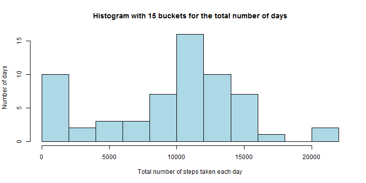
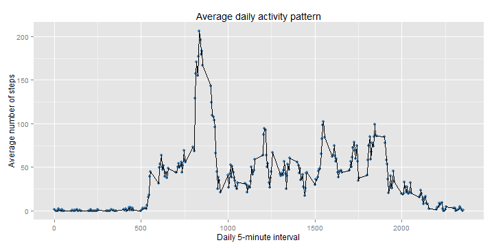
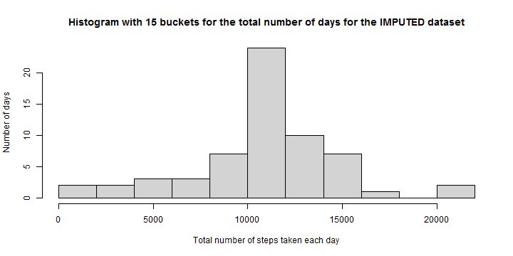
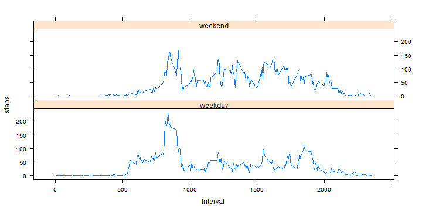

## Loading and preprocessing the data

### Overview: Loading and preprocessing the data consists of the following steps:
1. Defining some *name constants* to be used in subsequent code chunks.
2. Unzipping (if needed) and reading in the dataframe from csv-file.
3. Do some preprocessing.


### 1. Defining some *name constants* to be used in subsequent code chunks.

```r
# define constants for the input data file (for zip- and csv-version):
datafilebasename <- "activity"
datafilezip <- paste("./", datafilebasename, ".zip", sep="")
datafilecsv <- paste("./", datafilebasename, ".csv", sep="")
```

### 2. Unzipping (if needed) and reading in the dataframe from csv-file.
File ./activity.zip is assumed to exist in current directory.  
If file ./activity.csv does not yet exist it will be extracted form the zip-archive. 
After that *read.csv* is used to load ./activity.csv into a variable *df*  to hold the dataframe. 


```r
# if csv-input file not yet exists decompress the given zip-input file to generate it:
if(!file.exists(datafilecsv)){
        unzip(zipfile=datafilezip,exdir=".")
}
# read in the csv-input file into a dataframe variable:
df <- read.csv ("./activity.csv")
```

### 3. Do some preprocessing.
Finally a little preprocessing takes place:  
- Column *date* will be converted into a real *data* datatype using *as.Date*.


```r
df$date <- as.Date(as.character(df$date, "%Y-%m-%d"))
```


## What is the mean total number of steps taken per day?
Calculate the total number of steps taken per day:

```r
steps.total.perday <- with (df, tapply(df$steps, df$date, sum, na.rm=TRUE))
```
Following histogram has 15 buckets for total number of steps per day and shows
on its y-axis how frequently these buckets occur w.r.t. the single days.
You can abserve that the bucket with lower bound of 10000 steps per day  (quite in the
middle of the diagram) is the most frequently observed one: More than 15 days
of the 60 day observation period fall into this bucket.

```r
hist(steps.total.perday, breaks=15,
     main="Histogram with 15 buckets for the total number of days",
     col = "lightblue",
     xlab="Total number of steps taken each day", 
     ylab="Number of days")
```

 

Compute the mean and medium of the total number of steps taken per day with following code chunk:

```r
steps.mean.perday.rounded <- round(mean (steps.total.perday), digits=0)
steps.median.perday <- median (steps.total.perday)
```
The mean of the total number of steps taken per day is: **9354**.  
The median of the total number of steps taken per day is:  **10395**.

## What is the average daily activity pattern?
Prepare and plot the "Average daily activity pattern" diagram:

```r
library(ggplot2)
steps.mean.per5min <- with (df, tapply(df$steps, df$interval, mean, na.rm=TRUE))
# converting into a numeric vector:
steps.mean.per5min <- c(steps.mean.per5min)

vector.5min<-unique(df$interval)

df.5min.mean <- data.frame(vector.5min, steps.mean.per5min)

g <- ggplot(df.5min.mean, aes(vector.5min, steps.mean.per5min)) +
        geom_point(color="steelblue") +
        geom_line() +
        labs(title = "Average daily activity pattern") +
        labs(x="Daily 5-minute interval", y="Average number of steps") 
print(g)
```

 

Compute the (average) maximum number of steps based on all 5 minute intervals:

```r
max.5min.mean <- max(steps.mean.per5min)
interval.with.max.5min.mean <- df.5min.mean [df.5min.mean$steps.mean.per5min==max.5min.mean, ]$vector.5min
```
The 5-minute interval **835**, on average across all the days in the dataset, contains the maximum number **206** of steps!

## Imputing missing values
### 1. Calculate and report the total number of missing values in the dataset (i.e. the total number of rows with NAs).

```r
sum.na <- sum(is.na(df$steps))
```
The total number of missing values in the dataset (i.e. the total number of rows with NAs) is **2304**.

### 2. Srategy for filling in all of the missing values in the dataset. 
The means for the 5-minute intervals as computed before and stored into
data frame *df.5min.mean* will be used to impute the missing values.
If e.g. for the interval 250 the steps value is missing then the corresponding mean-over-all-days steps value for interval 250
will be looked up in *df.5min.mean* and used to complete this missing data.

### 3. Create a new dataset that is equal to the original dataset but with the missing data filled in.

```r
df.imputed <- df
for (i in 1:nrow(df.imputed)) {
        if (is.na(df.imputed[i,]$steps)) {
                df.imputed[i,]$steps <- round(df.5min.mean[df.5min.mean$vector.5min==df.imputed[i,]$interval, ]$steps.mean.per5min, 
                                              digits=0)
        } 
}
sum.na.imputed <- sum(is.na(df.imputed$steps))
```
It is verified that in the new data set *df.imputed* the number of 'NA' values for the steps really is *sum.na.imputed=* 0 now!

### 4a. Make a histogram of the total number of steps taken each day and Calculate and report the mean and median total number of steps taken per day. 

Calculate the total number of steps taken per day **for the imputed data set**:

```r
imputeddf.steps.total.perday <- with (df.imputed, tapply(df.imputed$steps, df.imputed$date, sum, na.rm=TRUE))
```
Following histogram **for the imputed data set**:

```r
hist(imputeddf.steps.total.perday, breaks=15,
     main="Histogram with 15 buckets for the total number of days for the IMPUTED dataset",
     col = "lightgrey",
     xlab="Total number of steps taken each day", 
     ylab="Number of days")
```

 

Compute the mean and medium of the total number of steps taken per day with following code chunk **for the imputed dataset**:

```r
imputeddf.steps.mean.perday.rounded <- round(mean (imputeddf.steps.total.perday), digits=0)
imputeddf.steps.median.perday <- median (imputeddf.steps.total.perday)
```
The mean of the total number of steps taken per day is: **10766**.  
The median of the total number of steps taken per day is: **10762**.

### 4b.  Do these values differ from the estimates from the first part of the assignment? And what is the impact of imputing missing data on the estimates of the total daily number of steps
Mean: original dataset vs. imputed dataset: **9354** vs **10766**.  
Mesian: original dataset vs. imputed dataset: **10395** vs. **10762**.  
  
You can see that the mean as well as the median of the imputed data set both are higher than in the original dataset.  

Imputing missing values with the chosen strategy (taking the corresponding 5-minutes-interval means) leads to mean and median values that are much closer compared to the original data set.


## Are there differences in activity patterns between weekdays and weekends?
### 1. Create a new factor variable in the dataset with two levels ‚<U+0080><U+0093> ‚<U+0080><U+009C>weekday‚<U+0080>ù and ‚<U+0080><U+009C>weekend‚<U+0080>ù indicating whether a given date is a weekday or weekend day.

```r
## function to compute the daytype ("weekend" or "weekday") for a given date!
f_daytype <- function (date) {
        ##print (weekdays(date)), !Note ther GERMAN locale!
        if (weekdays(date)=="Samstag" || weekdays(date)=="Sonntag") {
                "weekend"
        } 
        else {"weekday"
        }
}
## Add a daytype column to the imputed datase
df.imputed$daytype <- mapply(f_daytype, df.imputed$date)
## make variable daytype a factor variable:
df.imputed$daytype <- factor(df.imputed$daytype)
head(df.imputed)
```

```
##   steps       date interval daytype
## 1     2 2012-10-01        0 weekday
## 2     0 2012-10-01        5 weekday
## 3     0 2012-10-01       10 weekday
## 4     0 2012-10-01       15 weekday
## 5     0 2012-10-01       20 weekday
## 6     2 2012-10-01       25 weekday
```


### 2. Make a panel plot containing a time series plot (i.e. type = "l") of the 5-minute interval (x-axis) and the average number of steps taken, averaged across all weekday days or weekend days (y-axis). 

Using the *aggregate* function we do a "group by" for the column combination
*interval + daytype*. So for every daytype (i.e. "weekend"" or "weekday"")-interval-combination there will be one row in the resulting data set *df.imputed.grouped* containing the mean of the steps for this daytype and interval:

```r
df.imputed.grouped <- aggregate(steps ~ interval + daytype, 
                                data=df.imputed, 
                                FUN=mean)
```
Finally a panel plot for this new data set, containing only the grouped data, will be done, where the two panels are derived from the two factor variable values "weekend" and "weekday":


```r
library(lattice)

xyplot(steps~interval | daytype, 
       data=df.imputed.grouped, 
       layout=c(1,2),
       xlab="Interval",
       ylob="Number of steps",
       type="l",
       lty=1)
```

 

